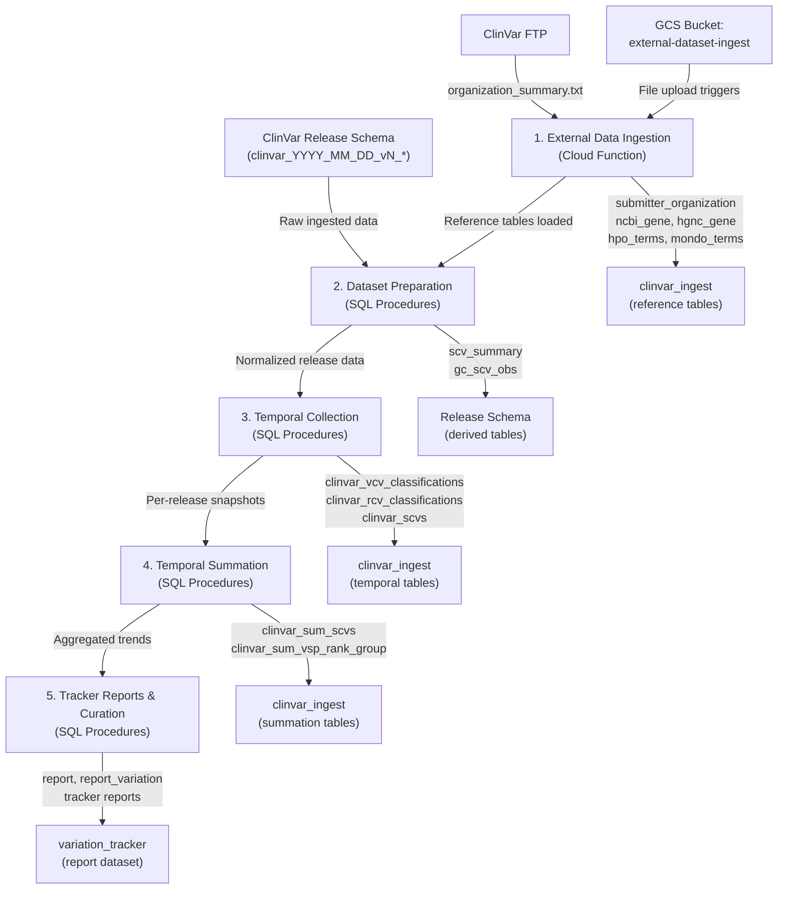

# Data Pipeline

The ClinVar data processing pipeline consists of five stages, each building on the output of the previous one. This page describes each stage in detail.

## Pipeline Overview

## Stage 1: External Data Ingestion

**Service:** GCS File Ingest Cloud Function (`gcp-services/gcs-file-ingest-service/`)

**Trigger:** File uploads to the `external-dataset-ingest` GCS bucket, or direct HTTP POST requests.

This Cloud Function monitors the GCS bucket for reference file updates and loads them into the `clinvar_ingest` BigQuery dataset. Each file type has its own processing path:

| File | BQ Table | Source | Processing |
|------|----------|--------|------------|
| `hp.json` | `hpo_terms` | HPO ontology | Extract nodes with HP IDs and labels |
| `mondo.json` | `mondo_terms` | MONDO ontology | Extract nodes with MONDO IDs, labels, and SKOS matches |
| `hgnc_gene.json` | `hgnc_gene` | HGNC | Extract gene records with symbols, aliases, and cross-references |
| `ncbi_gene.txt` | `ncbi_gene` | NCBI Gene | TSV parsing with pipe-delimited synonyms |
| `organization_summary.txt` | `submitter_organization` | ClinVar FTP (fetched live) | TSV parsing of submitter organization metadata |

!!! note
    For `organization_summary.txt`, the Cloud Function ignores the uploaded file and instead fetches the latest version directly from the ClinVar FTP site. This ensures the data is always current.

All tables are loaded using `WRITE_TRUNCATE` disposition, meaning each load fully replaces the previous data.

## Stage 2: Dataset Preparation

**Scripts:** `scripts/dataset-preparation/`

**Input:** A raw ClinVar release schema (e.g., `clinvar_2024_01_26_v2_6_0`) containing tables like `clinical_assertion`, `variation_archive`, `rcv_accession`, etc.

This stage normalizes and validates each ClinVar release before downstream processing:

### 2a. Setup Translation Tables (`00-setup-translation-tables.sql`)

Creates and populates lookup/reference tables in `clinvar_ingest`:

- **`clinvar_clinsig_types`** -- Maps classification codes to labels, significance levels, proposition types, and GKS attributes. Covers Germline, Oncogenicity, and Somatic Clinical Impact statement types.
- **`scv_clinsig_map`** -- Maps raw SCV interpretation description strings (e.g., "likely pathogenic", "vous", "mutation") to normalized `clinvar_clinsig_types` codes.
- **`status_rules`** / **`status_definitions`** -- Two-table system for review status ranking. `status_rules` defines the logical context (SCV vs. aggregate, conflict detection). `status_definitions` maps review statuses to star-rating ranks with temporal validity windows.
- **`clinvar_proposition_types`** -- Lookup table for proposition type codes and display order.
- **`submission_level`** -- Maps SCV integer ranks to labels and short codes (PG, EP, CP, etc.).

### 2b. Validate Dataset (`02-validate-dataset-proc.sql`)

The `validate_dataset` procedure runs a series of integrity checks against a release schema:

- Verifies all SCV classification terms exist in `scv_clinsig_map`
- Verifies all classification + statement_type combinations exist in `clinvar_clinsig_types`
- Checks SCV, RCV, and VCV review status terms against `status_rules` / `status_definitions`
- Validates `rcv_mapping` trait set ID consistency
- Checks required fields are non-null across key tables
- Validates release dates are consistent

If any check fails, the procedure raises an exception with a detailed error message listing all validation failures.

### 2c. Build SCV Summary (`03-scv-summary-proc.sql`)

The `scv_summary` procedure is the primary derived table for each release. It performs a multi-step build:

1. **Parse clinical assertions** -- Single pass over `clinical_assertion`, calling UDFs (`parseAttributeSet`, `parseComments`) to extract structured data from JSON `content` fields
2. **Parse observations** -- Extract sample origin, affected status, and method data from `clinical_assertion_observation`
3. **Build derived temp tables** -- Assertion methods, observation aggregates, PubMed citation IDs, and clinical significance with review status ranking
4. **Final assembly** -- Joins all temp tables with submitter, submission, and RCV data to produce the `scv_summary` table in the release schema

### 2d. Build GC SCV Observations (`05-gc_scv_obs-proc.sql`)

The `gc_scv_obs` procedure builds an observation-level table filtered to GC (Genomics Curation) submitters, joining across 10+ tables to produce a denormalized view used by curation workflows.

## Stage 3: Temporal Collection

**Scripts:** `scripts/temporal-data-collection/`

**Purpose:** Extract per-release snapshots into persistent temporal tables that track changes across ClinVar releases.

Each temporal collection procedure follows the same pattern:

1. **Validate** the previous release date matches expectations
2. **Mark deletions** -- Records present in the temporal table but absent from the current release get a `deleted_release_date`
3. **Update existing** -- Records that still match get their `end_release_date` extended
4. **Insert new** -- Records in the current release not yet tracked get a new row with `start_release_date` and `end_release_date` set to the current release date

The three temporal tables are:

| Procedure | Target Table | Tracks |
|-----------|-------------|--------|
| `clinvar_vcv_classifications` | `clinvar_ingest.clinvar_vcv_classifications` | VCV-level aggregate classifications (variation_id, statement_type, rank, description, submitter counts) |
| `clinvar_rcv_classifications` | `clinvar_ingest.clinvar_rcv_classifications` | RCV-level classifications (condition-specific interpretations) |
| `clinvar_scvs` | `clinvar_ingest.clinvar_scvs` | Individual SCV submissions (submitter, classification, review status, proposition type) |

!!! tip
    Each temporal table uses `start_release_date` / `end_release_date` / `deleted_release_date` columns to represent the lifecycle of a record. A record with `deleted_release_date IS NULL` is currently active. The date range indicates when a particular classification state was in effect.

## Stage 4: Temporal Summation

**Scripts:** `scripts/temporal-data-summation/`

**Purpose:** Aggregate the temporal data into trend summaries for analysis and visualization.

Key procedures and their output tables:

| Procedure | Output Table | Description |
|-----------|-------------|-------------|
| `clinvar_sum_variation_scv_change` | `clinvar_sum_variation_scv_change` | Variation-level SCV change events over time |
| `clinvar_sum_vsp_rank_group` | `clinvar_sum_vsp_rank_group` | Variation/statement/proposition rank groups with significance type distributions |
| `clinvar_sum_scvs` | `clinvar_sum_scvs` | Expanded SCV data joined with rank group summaries, including outlier percentages and group type labels |
| `clinvar_sum_vsp_rank_group_change` | `clinvar_sum_vsp_rank_group_change` | Changes in rank group composition over time |
| `clinvar_sum_vsp_top_rank_group_change` | `clinvar_sum_vsp_top_rank_group_change` | Top-rank group transitions |
| `clinvar_sum_variation_group_change` | `clinvar_sum_variation_group_change` | Variation-level group change summaries |

A coordinating procedure (`temporal-data-summation-proc.sql`) orchestrates all summation steps in sequence.

## Stage 5: Tracker Reports and Curation

**Scripts:** `scripts/tracker-report-update/` and `scripts/clinvar-curation/`

### Tracker Reports

The `variation_tracker` dataset contains report definitions and their output tables. The `tracker_reports_rebuild` procedure:

1. Pre-materializes shared temp tables (all releases, SCV ranges) once for all reports
2. For each active report, builds variation-level tracker data using the temporal SCV data
3. Generates alerts and change summaries

The `gc_tracker_report` procedure generates GC-specific tracker reports.

!!! info "Report Configuration"
    Reports are configured in the `variation_tracker.report` table with an `active` flag. The rebuild procedure processes all active reports by default, or a specific set of report IDs if provided.

### Curation Support

The `scripts/clinvar-curation/` directory contains scripts that support ClinVar curation workflows, including CVC (ClinVar Curation) table initialization and manuscript figure generation.
