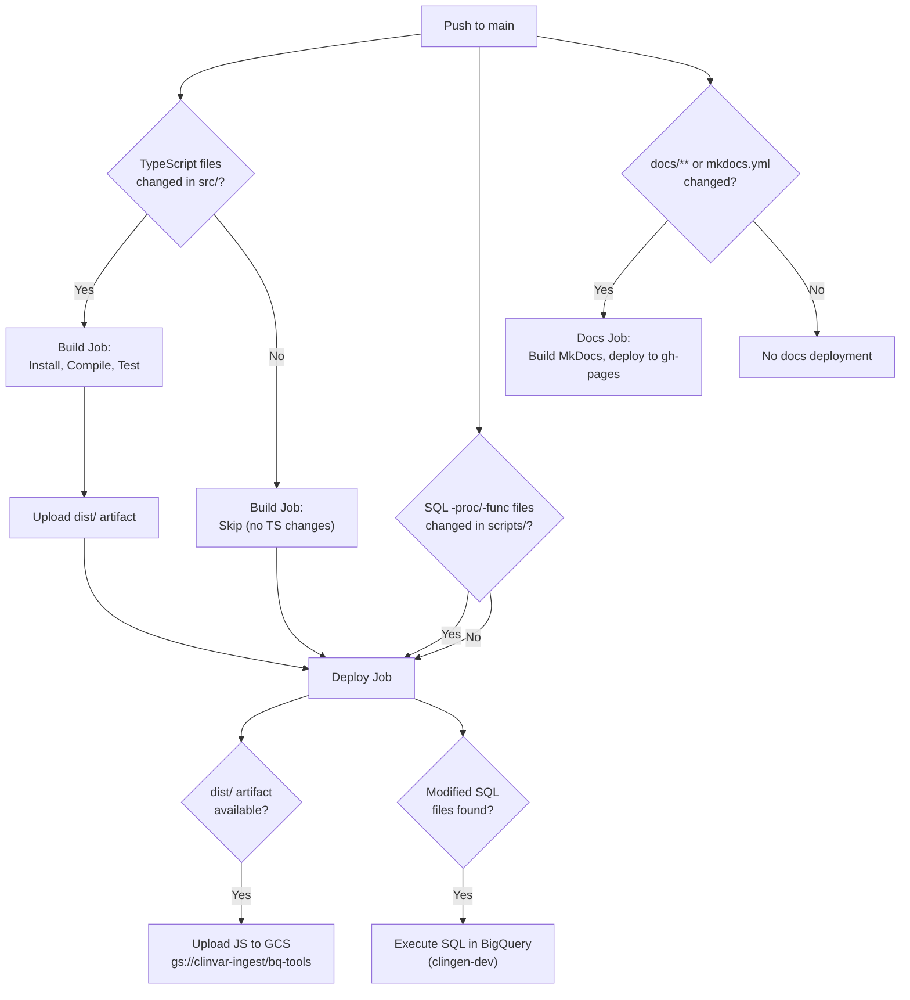

# CI/CD

This project uses GitHub Actions for continuous integration and deployment. There are two workflows: one for building and deploying code artifacts, and one for publishing documentation.

## Workflow Overview

## Build and Deploy Workflow

**File:** `.github/workflows/node.js.yml`
**Trigger:** Push to `main` branch

This workflow has two jobs that run sequentially: **build** and **deploy**.

### Build Job

The build job conditionally compiles TypeScript when source files have changed.

| Step | Condition | Action |
|------|-----------|--------|
| Check for TS changes | Always | Diffs `src/**/*.ts` between the previous and current commit |
| Setup Node.js | TS files modified | Installs Node.js 22 |
| Install dependencies | TS files modified | Runs `npm install` |
| Compile TypeScript | TS files modified | Runs `npx tsc` |
| Run tests | TS files modified | Runs `npm test` |
| Upload artifacts | TS files modified | Uploads `dist/` as a workflow artifact |

The build job outputs a `js_library_rebuilt` flag that the deploy job uses to determine whether to upload compiled JS files.

!!! info "Conditional execution"
    If no TypeScript files in `src/` were modified, the entire build step is skipped. The deploy job still runs to handle SQL changes.

### Deploy Job

The deploy job handles two independent deployment tasks:

**1. JavaScript library deployment to GCS**

When the build job produces new artifacts (`js_library_rebuilt == true`):

- Downloads the `dist/` artifact from the build job
- Authenticates to GCP using the `GCP_SA_KEY` secret
- Uploads compiled JS files to `gs://clinvar-ingest/bq-tools`

These JS files are used by BigQuery routines as external libraries.

**2. SQL procedure/function deployment to BigQuery**

When SQL files matching `scripts/**/*-proc.sql` or `scripts/**/*-func.sql` are modified:

- Identifies which `-proc.sql` and `-func.sql` files changed
- Authenticates to GCP (if not already authenticated for JS upload)
- Executes each modified SQL file against BigQuery in the `clingen-dev` project, sorted alphabetically

!!! tip "Auto-deploy convention"
    Only SQL files ending in `-proc.sql` or `-func.sql` are auto-deployed. Other SQL files (setup scripts, ad-hoc queries) are not executed by CI. This naming convention is important when adding new procedures -- see [Contributing](contributing.md) for details.

### Required Secrets

| Secret | Purpose |
|--------|---------|
| `GCP_SA_KEY` | Service account credentials JSON for authenticating to GCP |

## Documentation Workflow

**File:** `.github/workflows/docs.yml`
**Trigger:** Push to `main` when `docs/**` or `mkdocs.yml` changes, or manual dispatch

This is a single-job workflow that builds and deploys the MkDocs site.

| Step | Action |
|------|--------|
| Checkout | Checks out the repository |
| Setup Python | Installs Python 3.12 |
| Install MkDocs | Runs `pip install mkdocs-material` |
| Build and deploy | Runs `mkdocs gh-deploy --force` |

The site is published to GitHub Pages via the `gh-pages` branch. The workflow has `contents: write` permission to push to that branch.

!!! note "Manual trigger"
    The docs workflow supports `workflow_dispatch`, so you can trigger a docs rebuild from the GitHub Actions UI without pushing a commit.

## What Triggers What

| Changed files | Build job | JS upload to GCS | SQL execution | Docs deploy |
|---------------|-----------|------------------|---------------|-------------|
| `src/**/*.ts` | Runs | Yes | No | No |
| `scripts/**/*-proc.sql` | Skipped | No | Yes | No |
| `scripts/**/*-func.sql` | Skipped | No | Yes | No |
| `scripts/**/other.sql` | Skipped | No | No | No |
| `docs/**` | Skipped | No | No | Yes |
| `mkdocs.yml` | Skipped | No | No | Yes |
| Other files | Skipped | No | No | No |
