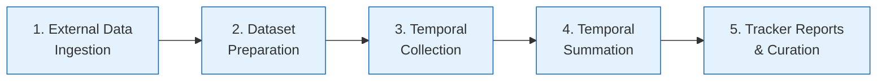

# ClinVar Ingest BigQuery Tools

[ClinVar](https://www.ncbi.nlm.nih.gov/clinvar/) is NCBI's public archive of
reports linking human genetic variants to clinical conditions, with supporting
evidence and interpretations submitted by clinical laboratories and researchers
worldwide. **clinvar-ingest-bq-tools** provides the TypeScript utilities, SQL
procedures, and GCP service infrastructure used to ingest, normalize, and
analyze ClinVar data inside Google BigQuery. The tooling covers everything from
parsing raw ClinVar XML/JSON fields and deriving HGVS expressions, to building
temporal snapshots of variant classifications across releases and generating
curation tracker reports.

---

## Pipeline Overview

The data-processing pipeline is organized into five stages:

| Stage | Description |
|-------|-------------|
| **1. External Data Ingestion** | A GCS-triggered Cloud Function updates reference tables for submitter organizations, NCBI genes, HPO terms, and MONDO terms. |
| **2. Dataset Preparation** | SQL procedures normalize ClinVar XML-to-JSON data, build the `scv_summary` table, and run validation checks. |
| **3. Temporal Collection** | Time-series snapshots of VCV, RCV, and SCV classifications are extracted for each ClinVar release. |
| **4. Temporal Summation** | Temporal data is aggregated into trend summaries suitable for downstream analysis. |
| **5. Tracker Reports & Curation** | GC tracker reports are generated and curation annotations are applied to support the ClinVar curation workflow. |

---

## Quick Links

| Section | Description |
|---------|-------------|
| [Getting Started](getting-started.md) | Prerequisites, installation, build, and test instructions |
| [Architecture](architecture.md) | Repository layout, data flow, and design decisions |
| [TypeScript Utilities](typescript-utils.md) | `bq-utils` and `parse-utils` API reference |
| [SQL Scripts](sql-scripts.md) | Procedure and function catalog organized by pipeline stage |
| [GCP Services](gcp-services.md) | Cloud Function deployment and configuration |
| [CI/CD](ci-cd.md) | GitHub Actions workflows and release process |
| [Contributing](contributing.md) | Development workflow, coding standards, and PR guidelines |
